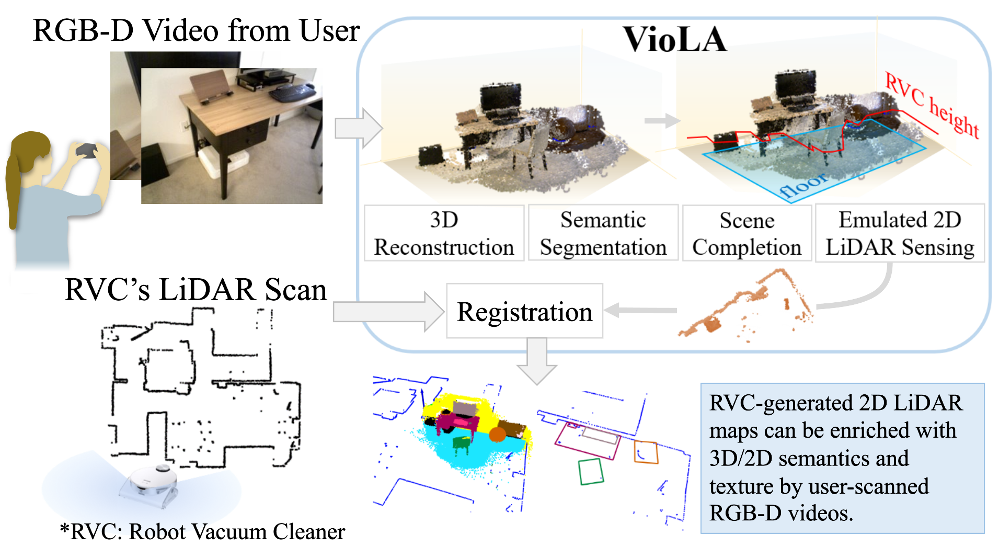

# VioLA: Aligning Videos to 2D LiDAR Scans

[Paper](https://arxiv.org/abs/2311.04783), [Project Page](https://giles200619.github.io/viola/)

Jun-Jee Chao*, Selim Engin*, Nikhil Chavan-Dafle, Bhoram Lee, Volkan Isler <br>
(* equal contribution)

This repository contains source codes for the project [VioLA: Aligning Videos to 2D LiDAR Scans](https://arxiv.org/abs/2311.04783).





To get started, clone the repository and initialize the submodules:

```
git clone https://github.com/giles200619/viola.git
cd viola
git submodule update --init --recursive
```

Please refer to the [installation instructions](docs/installation.md) to set up the environment.

We provide demo scripts in the next section to run VioLA on RGBD sequences as presented in the paper, as well as on RGB videos tagged with ARCore poses.


### Quick start:
For testing VioLA, we provide both RGBD and posed-RGB sample data. [Download](https://drive.google.com/file/d/1nWZ2-ErGIrEEXe6k6zqkEZ0vHUiGH_pU/view?usp=sharing) and unzip `viola_sample_data.zip`.<br />
#### To run posed-RGB sample data: <br />
This script provides a minimal but faster example to test VioLA on RGB sequences tagged with ARCore poses. Note that this example does not estimate semantic point cloud but only aligns video scans to the LiDAR map. The gravity direction is estimated with ARCore API. <br />
First modify the paths in `viola_posed_video.sh`:<br />
```
DATA_PATH=<path/to/viola_sample_data/posed_rgb/>
SCENE_NAME=arcore-dataset-2023-10-27-18-46-17
LIDAR_PATH=<path/to/viola_sample_data/posed_rgb/office.ply>
```
Then run:<br />
```
bash viola_posed_video.sh
```
If you run into import errors in `ms_deform_attn.py`, please follow the [instructions here](docs/fix_import_errors.md) for fixing them.

#### To run RGBD sample data: <br />
This example runs the full VioLA pipeline described in the main paper by first reconstructing the scene with Open3D, then apply Mask2Former to the key frames for semantic segmentation. The 2D masks are fused into 3D to obtain the semantic points clouds. Finally we perform pose registration and optionally, scene completion.<br />

You can either run the following command for testing VioLA, or continue from the steps below for more details.
```
bash viola_rgbd_video.sh
```

To start, first run the following for preprocessing (Open3d reconstruction + semantic point cloud prediction with Mask2Former):<br />
```
cd preprocess/
python redwood_open3d_m2f.py --data_path <path to viola_sample/redwood/loft_short> --open3d_path <path to open3d> --m2f_path ../mask2former --skip_every_n_frames 15
```
Note that this preprocessing can take some time, to speed up, one can optionally pass in the key `--no_aug` to disable image augmentation before semantic segmentation. In addition, increasing `--skip_every_n_frames` can reduce the number of key frames. However, these could hurt the semantic segmentation performance.<br />
After preprocessing, run:<br />
```
cd ..
python run_redwood.py --data_path <path to viola_sample/redwood/loft_short> --lidar_path <path to viola_sample/redwood/loft_lidar_dense.mat>
```

## Citing VioLA
```
@inproceedings{chao2024viola,
  title={VioLA: Aligning Videos to 2D LiDAR Scans},
  author={Chao, Jun-Jee and Engin, Selim and Chavan-Dafle, Nikhil and Lee, Bhoram and Isler, Volkan},
  booktitle={2024 IEEE International Conference on Robotics and Automation (ICRA)},
  pages={4021--4028},
  year={2024},
  organization={IEEE}
}
```
